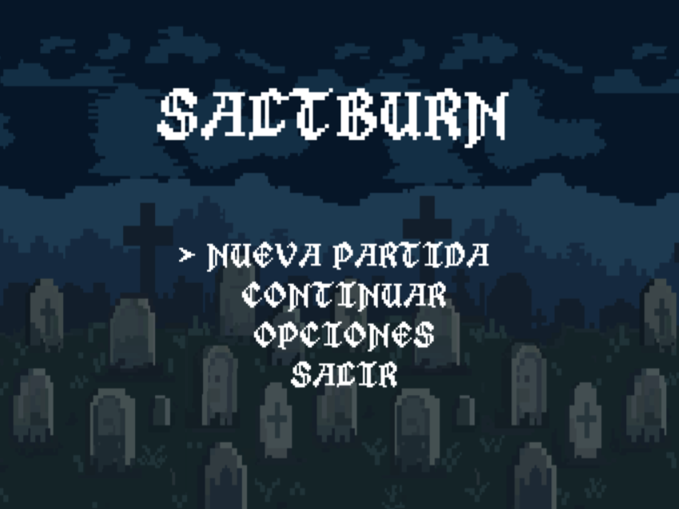
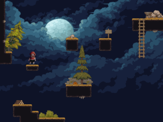
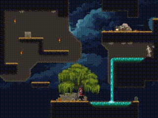

# SALTBURN

**SALTBURN** es un videojuego de plataformas 2D desarrollado con **LÖVE2D (Lua)**. El proyecto comenzó como una forma de aprender desarrollo de videojuegos desde cero, implementando manualmente cada uno de los sistemas del juego sin utilizar motores como Unity o Godot.

El objetivo del proyecto es recrear la sensación de los juegos de plataformas, incorporando mecánicas propias como el salto cargado y un movimiento preciso del personaje.

 

---

## Características

* Sistema de físicas propio.
* Movimiento horizontal y salto cargado.
* Animaciones de Idle, Run, Charge, Jump.
* Sistema de colisiones con plataformas.
* Múltiples habitaciones (Rooms).
* Fondos independientes para menú y juego.
* Menú principal.
* Menú de pausa.
* Menú de opciones.
* Música y efectos de sonido.
* Control de volumen (General, Música y Efectos).
* Pantalla completa.
* Sistema de guardado y carga de partida.
* Cronómetro de partida.
* Contador de saltos.
* Pantalla final con estadísticas.

---

## Controles

| Tecla       | Acción                                             |
| ----------- | -------------------------------------------------- |
| **A / D**   | Mover al personaje                                 |
| **Espacio** | Mantener para cargar el salto y soltar para saltar |
| **ESC**     | Abrir/Cerrar el menú de pausa                      |
| **W / S**   | Navegar por los menús                              |
| **Enter**   | Confirmar una opción                               |
| **← / →**   | Cambiar valores en el menú de opciones             |

---

## Gameplay

---

## Descargar

La versión ejecutable para Windows se encuentra en la sección **Releases** del repositorio.

Solo descarga el archivo comprimido, descomprímelo y ejecuta **SALTBURN.exe**.

---

## Tecnologías utilizadas

* Lua
* LÖVE2D 11.x
* STI (Simple Tiled Implementation)
* Tiled Map Editor

---

## Estado del proyecto

Actualmente el proyecto se encuentra en una versión **Alpha (Demo)**.

Las próximas actualizaciones incluirán nuevas mecánicas, efectos visuales, más niveles y mejoras generales en la jugabilidad.

---

## Autor

Desarrollado por **Isaac Lara**.

Proyecto realizado con fines de aprendizaje y práctica en programación de videojuegos.
